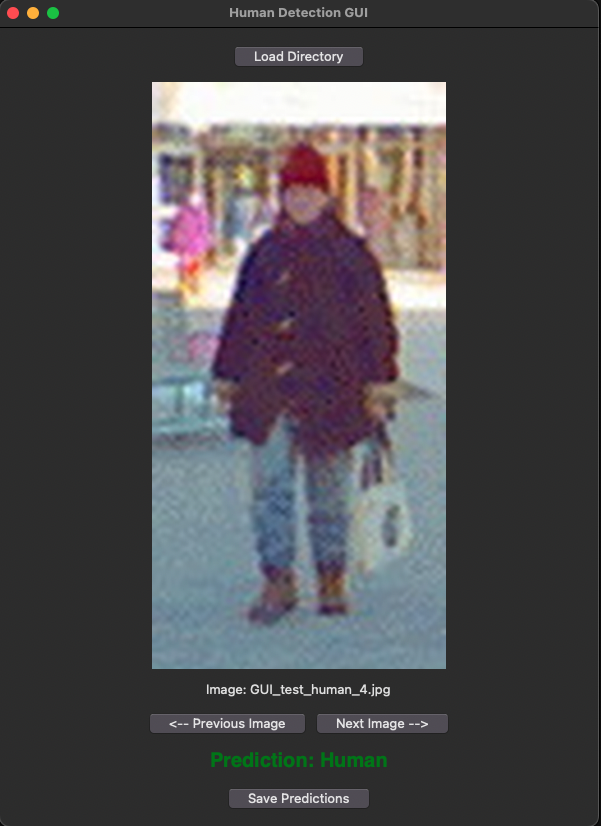
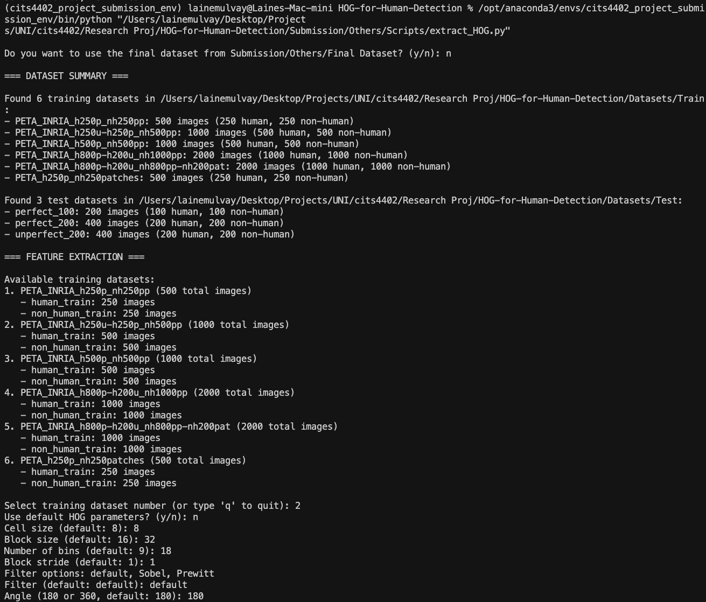
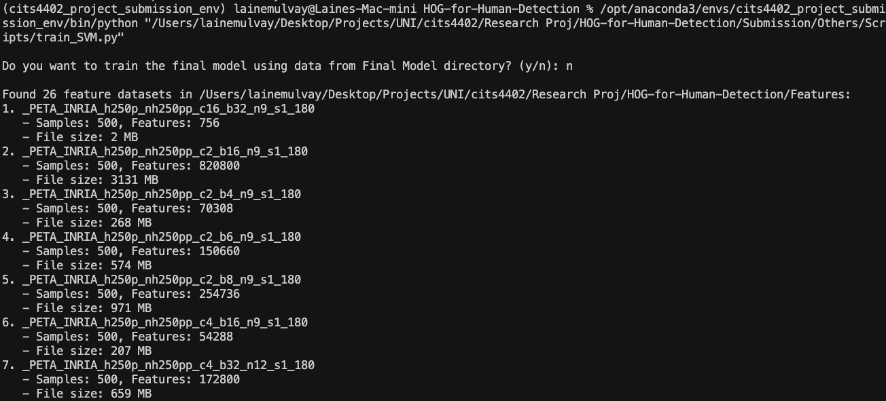
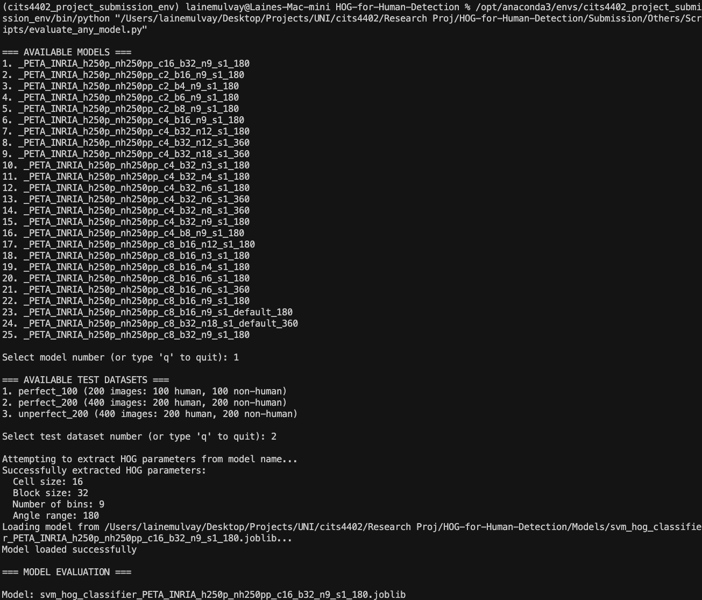

# HOG-based Human Detection System

This repository contains a human detection system using Histogram of Oriented Gradients (HOG) features and a Support Vector Machine (SVM) classifier, based on the method introduced by Dalal and Triggs (CVPR 2005).

## Overview

We've developed a system that extracts HOG features from images and uses an SVM to classify them as either human or non-human. The project implements a complete pipeline from data preparation to feature extraction, model training, and evaluation through a graphical user interface.

## Setup
> ❗ **If you don't have Conda installed**, download and install **Miniconda** (recommended) from:  
> https://docs.conda.io/en/latest/miniconda.html  
> This gives you access to `conda` without the full Anaconda package.

Once Conda is installed:

```bash
# Create the Conda environment
conda env create -f environment.yml

# Activate the environment
conda activate cits4402_project_env
```

## Running the GUI

```bash
# Navigate to the Submission folder
cd Submission

# Run the GUI
python GUI.py
```
##### GUI Features:
The GUI allows you to test our model on any image. You can:
- Select images from the included "Testing Images" folder
- Upload your own images (64x128)
- View real-time classification results
- Save test results to .xlsx
- See confidence scores for each classification
- Visualise the HOG features extracted from the image

<div align="center">
  
</div>

## Final Model

Our final model uses the following parameters:
- **HOG parameters**: 
  - Cell Size: 8×8 pixels
  - Block Size: 16×16 pixels (2×2 cells)
  - Orientation Bins: 9 bins (0°-180°)
  - Block Stride: 1 cell (8 pixels)
  - Filter: Default gradient filter
  - Normalisation: L2-Hys

- **SVM parameters**: 
  - Linear kernel
  - C=1.0
  - Probability estimates enabled

- **Training data**: 
  - 250 human samples from PETA MIT dataset
  - 250 non-human samples extracted from INRIA dataset

The model achieves:
- 99.5% accuracy on the perfect_200 test set
- 87.75% accuracy on the unperfect_200 test set

## Documentation

- Detailed analysis and results can be found in `Submission/Report.ipynb`
- Dataset descriptions are available in `docs/DATA_OVERVIEW.md`
- Model naming conventions are explained in `docs/MODEL_NAME_CONVENTION.md`
- Development notebooks and analysis can be found in the `notebooks/` directory:
  - `ablation.ipynb`: HOG parameter ablation studies
  - `test_all_models.ipynb`: Model evaluation and selection
  - `archive/`: Historical development notebooks including initial HOG and SVM implementations
    - `create_negatives_INRIA.ipynb`: Design of non-human image extraction from INRIA dataset

## Note

Only the `Submission` folder was included in the final project submission. It contains a standalone version of the application with the final model and sample images for testing.

> **Repository Note:**  
> This is the second version of this repository. The original repository encountered issues with large file storage (Git LFS) when attempting to upload models and data.  
> To view the full commit history and earlier development, please visit:  
> [https://github.com/coffeemartin/HOG-for-Human-Detection](https://github.com/coffeemartin/HOG-for-Human-Detection)

## Custom Pipeline: Feature Extraction, Training, and Evaluation

Easily build and test your own pipeline using the provided scripts:

1. **Extract HOG Features:**
  - Run `extract_HOG.py` to extract features from any dataset with custom parameters.
  - Features are saved in `Features/`.

  

2. **Train SVM Model:**
  - Run `train_SVM.py` to train on any set of features.
  - Models are saved in `Models/`.

  

3. **Evaluate Model:**
  - Run `evaluate_any_model.py` to test any model on any test set.
  - View results and metrics interactively.

   

This modular workflow lets you experiment with any combination of datasets, features, and models.

## Project Structure

```
.
├── Datasets/                    # All dataset directories
│   ├── Raw/                    # Source data
│   │   ├── created/           # Processed subsets for test and train sets
│   │   └── original/          # INRIA and PETA source datasets
│   ├── Test/                  # Testing datasets
│   │   ├── perfect_100/       # 100 high-quality test samples
│   │   ├── perfect_200/       # 200 high-quality test samples
│   │   └── unperfect_200/     # 200 challenging test samples
│   └── Train/                 # Training datasets with different compositions
│       ├── PETA_INRIA_h250p_nh250pp/        # 250 perfect human + 250 perfect non-human
│       ├── PETA_INRIA_h500p_nh500pp/        # 500 perfect human + 500 perfect non-human
│       └── ... (other training set variations)
├── Features/                   # Pre-extracted HOG features (.npy files)
├── Models/                     # Trained SVM classifier models (.joblib files)
├── Submission/                 # Final submission folder with standalone application
│   ├── GUI.py                 # Main application with GUI interface
│   ├── Others/                # Supporting files
│   │   ├── Final Model/       # Selected best model
│   │   ├── Scripts/           # Core functionality scripts
│   │   ├── docs/              # Documentation files
│   │   ├── example_images/    # Example images for report
│   │   └── notebooks/         # Development notebooks
│   ├── Testing Images/        # Sample images for GUI testing
│   └── environment.yml        # Conda environment configuration
├── docs/                      # Project documentation
│   ├── DATA_OVERVIEW.md       # Dataset organisation details
│   └── MODEL_NAME_CONVENTION.md # Model naming scheme
├── notebooks/                 # Development notebooks
│   ├── ablation.ipynb         # HOG parameter studies
│   ├── archive/               # Historical development notebooks
│   ├── outputs/               # Generated analysis plots and results
│   └── test_all_models.ipynb  # Model evaluation
└── environment.yml            # Main project environment configuration
```

## Contributors

- **Laine Mulvay** (Student ID: 22708032)
- **Franco Meng** (Student ID: 23370209)

