# CITS 4402 Computer Vision
**Group:** Franco Meng (23370209), Laine Mulvay (22708032)  
**Date:** 23-May-2025

# Histograms of Oriented Gradients for Human Detection

This report aims to present a clear methodology and findings on using Histogram of Oriented Gradients (HOG) and linear SVM for image classification.

## Phase 1 - Dataset Collection

### 1.1 Human Data

The human image data used in this project were sourced from two subfolders, PRID and MIT, within the Pedestrian Attribute Recognition at Far Distance, [PETA (PEdesTrian Attribute) dataset](https://mmlab.ie.cuhk.edu.hk/projects/PETA.html).

To ensure diversity in the dataset, we selected images that represent all viewing angles — front, back, and side. The PRID subset includes multiple images of the same individual from different perspectives, labelled with suffixes such as -a and -b. To maximise training data diversity, we aimed to excluded images of the same person taken from different angles.

The selected human images are stored in either **JPG** or **PNG** formats and have a uniform resolution of **64×128** pixels.

### 1.2 Non-human Data

Non-human images were derived from the [INRIA Person Dataset](https://www.kaggle.com/datasets/jcoral02/inriaperson), which contains 1,811 images along with XML annotations that mark human regions.

To generate negative (non-human) samples:

- We first located the annotated human regions.
- We then extracted horizontally adjacent areas that did not contain a human annotation.

The above pre-processing approach by extracting non-human regions nearby to human regions, created more realistic non-human examples, closely resembling real-world scenes.

All non-human images are in **JPG** format and resized to **64×128** pixels.


### 1.3 Testing/Validation Data
Two balanced testing datasets were created, each containing:

- 200 positive samples (human)
- 200 negative samples (non-human)

\newpage

These two versions are:

**Perfect Dataset:**

- All human images are clean and directly sourced from the PETA dataset.
- All non-human images are hand selected from processed INRIA dataset to ensure they contain non recognisable humans within the image.
- Examples of perfect images:

<div align="center">

| 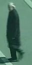 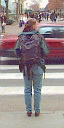 | 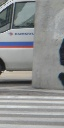 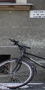 |
|:---:|:---:|
| *Figure 1: Examples of perfect human images* | *Figure 2: Examples of perfect non-human images* |

</div>


**Imperfect Dataset:**

- 25% of human images were carefully selected from our processed INRIA dataset, they were initially misclassified as non-human but contain clearly visible human subjects. Unlike the pristine PETA examples, these images may have varying zoom levels or contain multiple humans, making them more challenging to classify.
- 25% of non-human images are randomly sampled from external landscape images that contain no humans. These images are cropped into 64x128 pixel patches, introducing more diverse visual elements and textures compared to the INRIA dataset.
- Examples of imperfect images:

<div align="center">

| 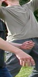 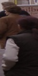 |  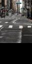 |
|:---:|:---:|
| *Figure 3: Examples of imperfect human images* | *Figure 4: Examples of imperfect non-human images* |

</div>

#### Why Two Test Sets?
To enable a meaningful ablation study, we created both a 'perfect' and an 'imperfect' test set. Our default-parameter model achieved 99.5% accuracy on the perfect dataset, meaning nearly all models in ablation would score near 100%, making it impossible to distinguish between them. The imperfect set was designed to be more challenging, ensuring enough variation in results to effectively compare and select the best model parameters


\newpage

### *1.4 Further study* (Impact of imperfect training data and dataset size)

Since the initial training dataset only contained perfect human images, we conducted additional experiments to evaluate how both imperfect training data and dataset size affect model performance.

In this extended study:

- We gradually introduced imperfect human images into the training dataset.
- These imperfect images were extracted from the annotated human regions of the INRIA dataset, representing noise or ambiguous cases.
- We also experimented with different training set sizes, ranging from 250 to 1000 samples per class.
- All models were trained using the same HOG feature parameters and SVM settings to ensure comparability.

<div align="center">

| 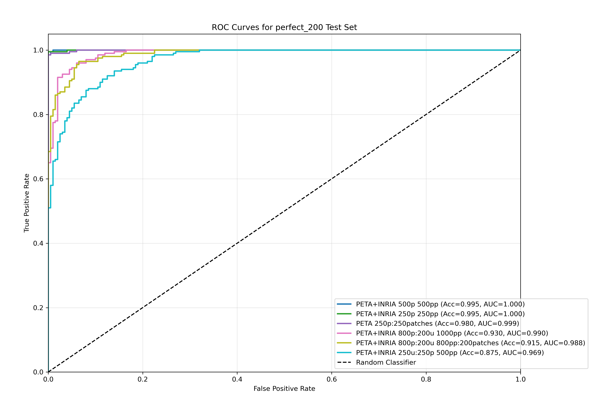 | 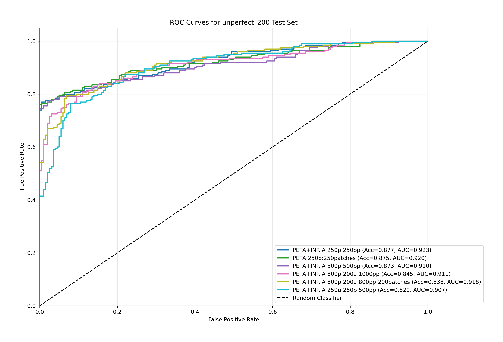 |
|:---:|:---:|
| *Figure 5: ROC curves comparing different training configurations on the perfect test set* | *Figure 6: ROC curves comparing different training configurations on the imperfect test set* |

</div>

By using ROC curve and AUC as a performance measure, we found that:

- Models trained on **clean (perfect) human data** performed relatively well on both perfect and imperfect test sets. This may imply that clean training data, while not representing true population diversity, significantly improves a model's ability to distinguish between human and non-human subjects.
- The model trained with **50% imperfect human data** showed the **worst performance** across both test sets, suggesting that excessive noise in training data degrades the model's ability to generalise.
- **Increasing the training set size** beyond 250 samples per class led to **decreased performance** on both test sets. This suggests that larger datasets may cause the model to overfit or learn noise patterns, rather than generalisable features for human detection.


Based on these findings, we selected a training set containing 250 perfect human images and 250 non-human images, as this smaller dataset size appears to prevent overfitting while maintaining strong classification performance.

\newpage

## Phase 2 - Feature Extraction & Model Training

### 2.1 Custom Implementation of HOG Feature Descriptor

Instead of using prebuilt functions like `cv2.HOGDescriptor` or `skimage.feature.hog`, we implemented the HOG feature descriptor from scratch. This decision was made to:

- Gain a deeper understanding of the HOG algorithm and its step-by-step process.
- Allow full flexibility in tuning parameters and conducting ablation studies.
- Overcome limitations of existing libraries, such as the `cv2.HOGDescriptor`'s inability to customise filters in OpenCV's implementation - making it unsuitable for experiments involving different filters like Sobel, Prewitt.

### 2.2 Function Definition

```python
compute_hog(image, cell_size=8, block_size=16, num_bins=9, block_stride=1, filter_="default", angle_=180)
```

Parameters:

- `image`: A grayscale image of size 64×128 pixels. Input must be a 2D array.
- `cell_size` (default = 8): Specifies the width and height (in pixels) of each cell. A cell of size 8 means each cell covers an 8×8 pixel region.
- `block_size` (default = 16): Defines the size of a block, measured in pixels. A block of size 16 includes four 8×8 cells (2×2 grid).
- `num_bins` (default = 9): Number of orientation bins in the histogram. If the angle range is 360°, each bin represents a 40° segment.
- `block_stride` (default = 1): The stride when moving the block window, measured in cells. A stride of 1 moves the block by one cell at a time, creating overlapping blocks.
- `filter_` (default="default"): Specifies the filter applied before computing gradient magnitudes and orientations.
  - 'Default': A basic 1D derivative filter [-1, 0, 1] applied in both x and y directions.
  - 'Prewitt': Equal-weight filter that enhances sharp edges.
  - 'Sobel': Weighted filter that emphasises the central pixel, offering smoother gradients and improved noise resistance.
- `angle_` (default=180): The unit is in degrees, not radians. If set to 180°, angles wrap (e.g., 270° becomes 90°). Magnitudes and angles are computed using OpenCV's [cv2.cartToPolar](https://docs.opencv.org/3.0-beta/modules/core/doc/operations_on_arrays.html#carttopolar), which provides angle estimates with ~0.3° precision.

<div align="center">

{width=30%}

</div>

<div align="center">

*Figure 7: Mathematical representation of gradient magnitude and orientation calculation using cartToPolar*

</div>

\newpage

### 2.3 HOG Feature Extraction Pipeline

1. Raw Image Input
2. Grayscale Conversion
3. Resizing to a fixed dimension of 64×128 pixels.
4. Gradient Filtering
5. Gradient Magnitude and Orientation Calculation
6. Histogram of Oriented Gradients (HOG) Construction
7. Block Normalisation and Histogram Concatenation

   - Histograms from cells are grouped into overlapping blocks (e.g., 2×2 cells or 16×16 pixels).
   - Within each block, histograms are concatenated and normalised to improve invariance to lighting changes.
8. Final Feature Vector Creation

   - All block-level normalised histograms are concatenated into a single feature vector for the image.
   - The length of the final feature vector depends on parameters like block size, cell size, and block stride.

At this stage, each image has been transformed into a numeric feature representation, ready for feeding into a Linear SVM model.

### 2.4 SVM and Classification

After labelling the corresponding features with 1 and 0, we use `LinearSVC()` from scikit-learn for model training, with no advanced hyperparameter tuning.

### 2.5 Evaluation

We evaluated the model using two complementary methods:

- Standard ROC Curve and AUC Score
- Detection Error Tradeoff (DET) curve.

The DET curve plots miss rate (1-TPR) vs False Positives Per Window (FFPW).

This evaluation method was adopted from the original HOG paper, where detection was performed across sliding windows on larger images. But in our case, each window equals the entire image, so FPPW is equivalent to FP.

The DET curve is plotted on a logarithmic scale, allowing better insight into small performance differences.

\newpage

## Phase 3 - Ablation Study

Due to the high performance (AUC close to 1) achieved on the perfect testing dataset, we conducted an ablation study using the imperfect testing dataset to more thoroughly investigate the model's sensitivity under different parameters.

In this ablation study, rather than performing a full grid search across all possible parameter combinations, we strategically focused on two specific sets of parameters. This selective approach allows us to isolate and analyse the impact of individual factors.

For each combination, the HOG features were re-extracted from the training and testing datasets, and the model was retrained from scratch using the same SVM settings.

The resulting performance was tabled using both Accuracy and AUC scores on the imperfect testing dataset.

We mainly focus on the AUC scores. The comparison plots below present how different configurations impact the model's ability to generalise.

### 3.1 Set 1: Cell size & Block size

We examined the following 10 cell size and block size combinations:

**[(2,4), (2,6), (2,8), (2,16), (4,8), (4,16), (4,32), (8,16), (8,32), (16,32)]**

<div align="center">

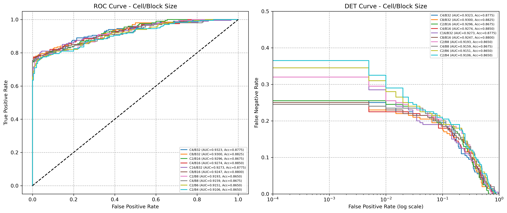

*Figure 8: Performance comparison of different cell size and block size combinations*

\newpage

</div>

<div style="text-align: center">

**Table 1: Performance comparison of different cell size and block size combinations**

</div>

<div style="display: flex; justify-content: center">

| Cell Size / Block Size | AUC    | Accuracy |
|----------------------|---------|-----------|
| **4x4 / 32x32**     | **0.9323** | **0.8775** |
| 8x8 / 32x32         | 0.9300  | 0.8825    |
| 2x2 / 16x16         | 0.9296  | 0.8675    |
| 4x4 / 16x16         | 0.9274  | 0.8850    |
| 16x16 / 32x32       | 0.9272  | 0.8775    |
| 8x8 / 16x16         | 0.9247  | 0.8800    |
| 2x2 / 8x8           | 0.9193  | 0.8650    |
| 4x4 / 8x8           | 0.9159  | 0.8675    |
| 2x2 / 6x6           | 0.9151  | 0.8650    |
| 2x2 / 4x4           | 0.9106  | 0.8650    |

</div>

The model presents better performance in terms of AUC when using **larger block sizes** combined with **relatively smaller cell sizes**. This may be due to:

- The smaller cell size will capture the fine local details around edges and corners.
- The large regions defined by the large block size, providing broader information for the block normalisation, helping the model to be less variant to sharp illumination changes.

With the block stride set to the default value of 1, using small cell size and large block size would generate more overlapping blocks, creating more features to represent the image. This would increase the computation cost.

We have then fixed the cell and block size to be 4x4 and 32x32, for the following Set 2 ablation study.

\newpage

### 3.2 Set 2: Bin size and Orientation Angle

We examined the following 9 bin size and orientation angle combinations:

**[(3,180), (4,180), (6,180), (8,180), (9,180), (12,180), (6,360), (8,360), (12,360), (18,360)]**

<div align="center">

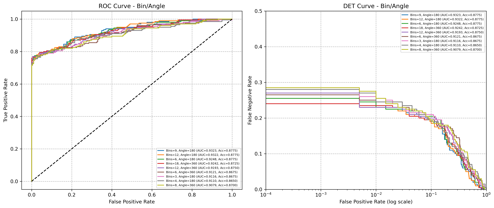

*Figure 9: Performance comparison of different bin size and orientation angle combinations*

</div>


<div style="text-align: center">

**Table 2: Performance comparison of different bin size and orientation angle combinations**

</div>

<div style="display: flex; justify-content: center">

| Bin Size / Angle | AUC    | Accuracy |
|-----------------|---------|-----------|
| **9 / 180°**       | **0.9323**  | **0.8775**    |
| 12 / 180°      | 0.9322  | 0.8775    |
| 6 / 180°       | 0.9248  | 0.8775    |
| 18 / 360°      | 0.9242  | 0.8725    |
| 12 / 360°      | 0.9193  | 0.8750    |
| 6 / 360°       | 0.9121  | 0.8675    |
| 3 / 180°       | 0.9116  | 0.8675    |
| 4 / 180°       | 0.9110  | 0.8650    |
| 8 / 360°       | 0.9079  | 0.8700    |

</div>

With the 9 bins over 180° orientation scale, the model tends to perform the best according to AUC and Accuracy. However, with the low bin size 3-4, the feature may not be able to capture the important orientation details. The 360° signed orientation didn't really help to improve the performance significantly.

The above findings are in line with those of the original HOG paper by Dalal and Triggs (2005), cited:

> "Increasing the number of orientation bins improves performance significantly up to about 9 bins… For humans, the wide range of clothing and background colours presumably makes the signs of contrast uninformative. However, note that including sign information does help substantially in some other object recognition tasks." (Dalal & Triggs, 2005)

\newpage

###  3.3 Final HOG Parameters and Model

After conducting the ablation studies, the following parameters were selected for the final HOG descriptor and SVM model:

| Parameter      | Final Value | Default Value |
|----------------|-------------|---------------|
| Cell size      | **4 x 4**       | 8 x 8         |
| Block Size     | **32 x 32**     | 16 x 16       |
| Bin Number     | **9**           | 9             |
| Orientation Angle | **180°**     | 180°          |
| Filter         | **[-1, 0, 1]**  | [-1, 0, 1]    |
| Block Stride   | **1**           | 1             |

It is worth noting that an earlier comparison of different gradient filters was also conducted, although not included in the final report. In that initial study, the simple [-1,0,1] filter without any smoothing yielded the best performance. Dalal and Triggs (2005) offered some explanation, stating that excessive smoothing before gradient computation can damage HOG performance, highlighting the importance of preserving information retrieved from **abrupt edges at fine scales**.

\newpage

### 3.4 Evaluation of the Final Model

The following results illustrate the performance of the final model using both the default and optimised HOG parameter settings on the perfect and imperfect test sets.

#### 3.4.1 Default HOG Parameter Settings

- Perfect Test set: **2 misclassified**

  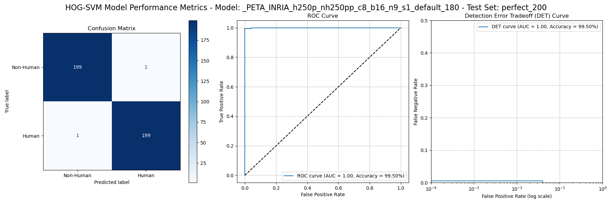
  
  *Figure 10: Default HOG parameters – Perfect test set*

- Imperfect Test set: **49 misclassified, AUC = 0.92**

  
  
  *Figure 11: Default HOG parameters – Imperfect test set*

\newpage

#### 3.4.2 Final HOG Parameter Settings

- Perfect Test set: **1 misclassified**

  
  
  *Figure 12: Final HOG parameters – Perfect test set*

- Imperfect Test Set: **49 misclassified, AUC = 0.93**

  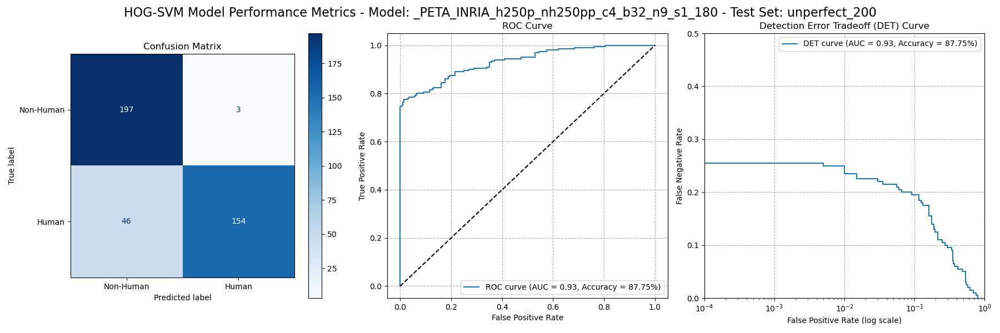
  
  *Figure 13: Final HOG parameters – Imperfect test set*

#### 3.4.3 Discussion

The final model with best HOG parameters found through ablation study, successfully reduced the number of misclassified images from 2 to 1 on the perfect testing data. It also improved the AUC score from 0.92 to 0.93 on the imperfect testing data.

Although the differences may seem minor, they highlighted the importance of carefully choosing HOG descriptor parameters, to ensure the feature extracted effectively capture enough information for high performance classification. Ideally, a comprehensive grid search over all possible parameter combination may produce even better results.

Another key finding from our extra study in Section 1.4, is that introducing excessive noise into the training set can reduce the effectiveness of the HOG descriptor. This decline in performance may be attributed to the **scale-variant** nature of HOG. When training data includes small or partial human figures, the descriptor may struggle to handle the scale variations.

## Reference

[Dalal, N., & Triggs, B. (2005). Histograms of oriented gradients for human detection. In 2005 IEEE Computer Society Conference on Computer Vision and Pattern Recognition (CVPR'05) (Vol. 1, pp. 886–893). IEEE](https://doi.org/10.1109/CVPR.2005.177)